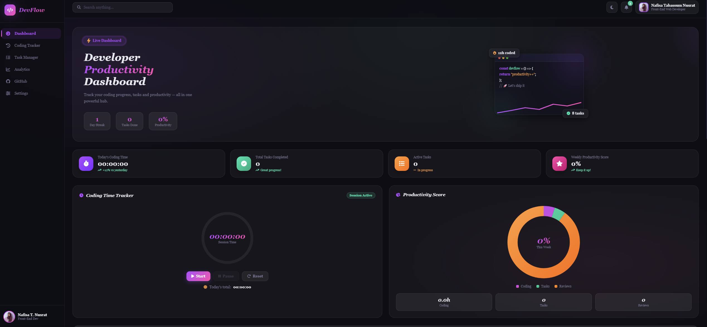
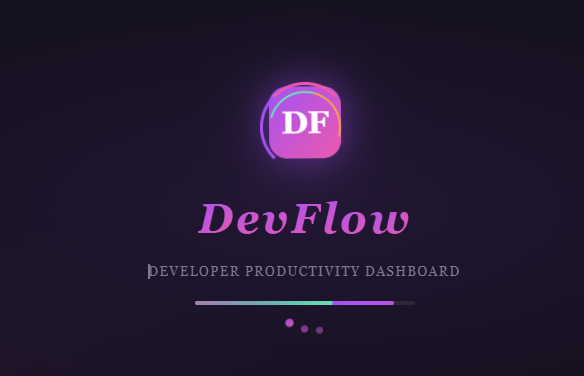
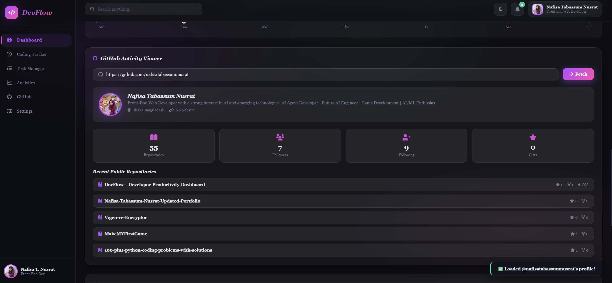
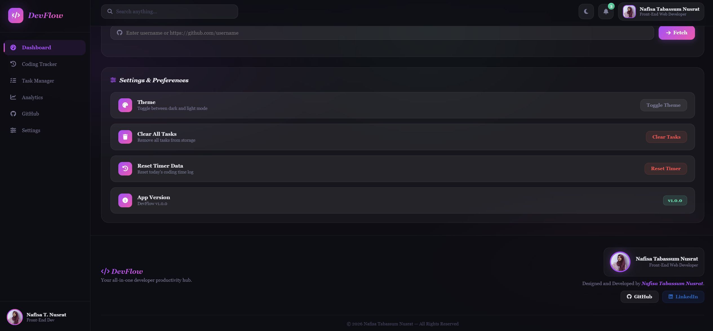

  

---

## 🌐 Live Demo  
👉 https://nafisatabassumnusrat.github.io/DevFlow---Developer-Productivity-Dashboard/

---

## 📸 Preview  

---

## ✨ About The Project  

**DevFlow** is a modern, interactive and fully responsive developer productivity dashboard built using pure **HTML, CSS, and JavaScript**.

It helps developers track coding time, manage tasks, visualize productivity, and even view GitHub profiles — all in one powerful and clean interface.

---

## 🚀 Features  

### 🧠 Productivity System
- ⏱️ Real-time coding session tracker  
- 🔥 Daily streak tracking  
- 📊 Weekly productivity score  
- 🎯 Focus-based workflow  

### 📋 Task Manager
- ➕ Add / Edit / Delete tasks  
- 🏷️ Priority system (Low / Medium / High)  
- 🔍 Smart filtering (All / Active / Completed)  
- 💾 Local storage support  

### 📊 Analytics
- 📈 Weekly performance charts  
- 📉 Coding vs Task visualization  
- ⚡ Real-time updates  

### 🐙 GitHub Integration
- 🔎 Search any GitHub username  
- 👤 Profile details (avatar, bio, location)  
- 📦 Repositories overview  
- ⭐ Followers / Following / Gists  

### 🎨 UI / UX
- 🌙 Dark / Light mode toggle  
- 💎 Glassmorphism design  
- ✨ Smooth animations  
- 📱 Fully responsive  
- ⚡ Animated loading screen  

---

## 🛠️ Tech Stack  

- HTML5  
- CSS3  
- JavaScript (Vanilla)  
- Chart.js  
- Font Awesome  

---

## 📂 Sections  

- 🏠 Dashboard  
- ⏱️ Coding Tracker  
- 📋 Task Manager  
- 📊 Analytics  
- 🐙 GitHub Viewer  
- ⚙️ Settings  
- 👩‍💻 Developer Footer  

---

html
👩‍💻 Developer

Nafisa Tabassum Nusrat
💻 Front-End Web Developer

🔗 Connect With Me

🐙 GitHub: https://github.com/nafisatabassumnusrat

💼 LinkedIn: https://www.linkedin.com/in/nafisa-tabassum-nusrat-57134721a/

📌 Future Improvements

🔔 Notification system

📅 Calendar integration

☁️ Cloud sync (Firebase)

🤖 AI productivity suggestions

📊 Advanced analytics

⭐ Support

If you like this project, give it a ⭐ on GitHub — it motivates me to build more!
